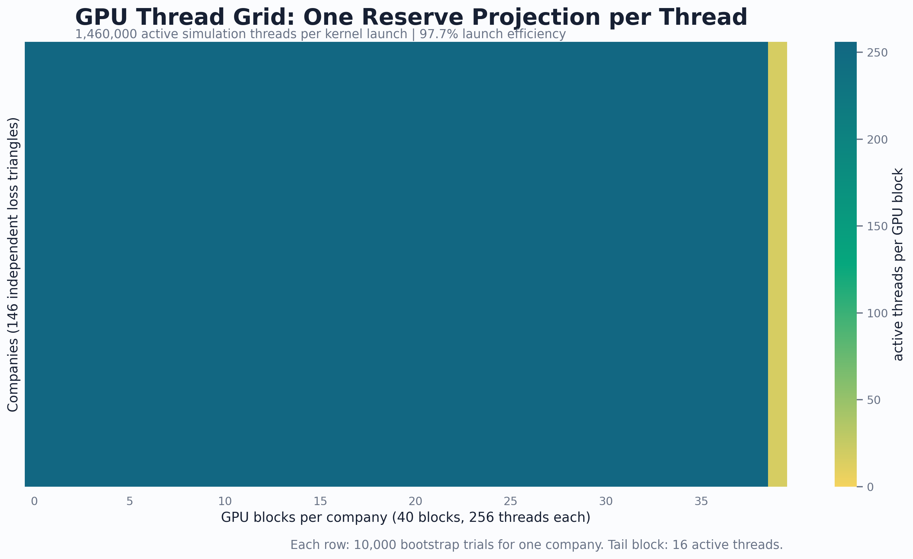
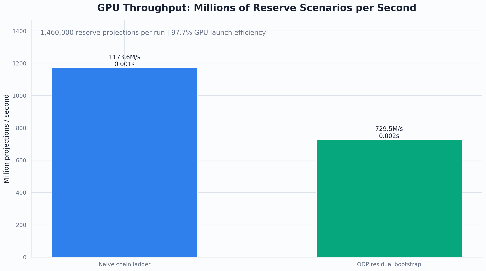
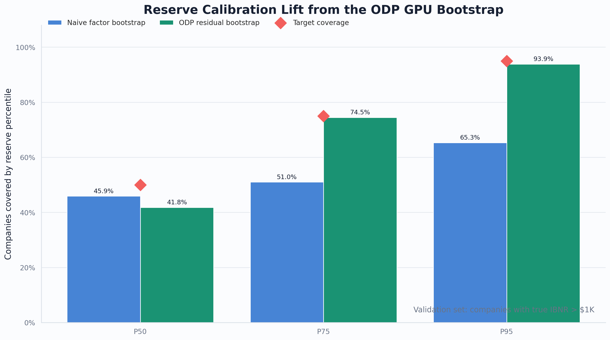
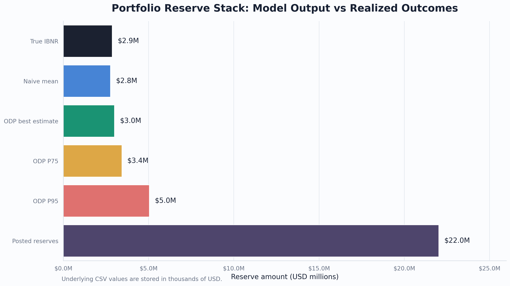
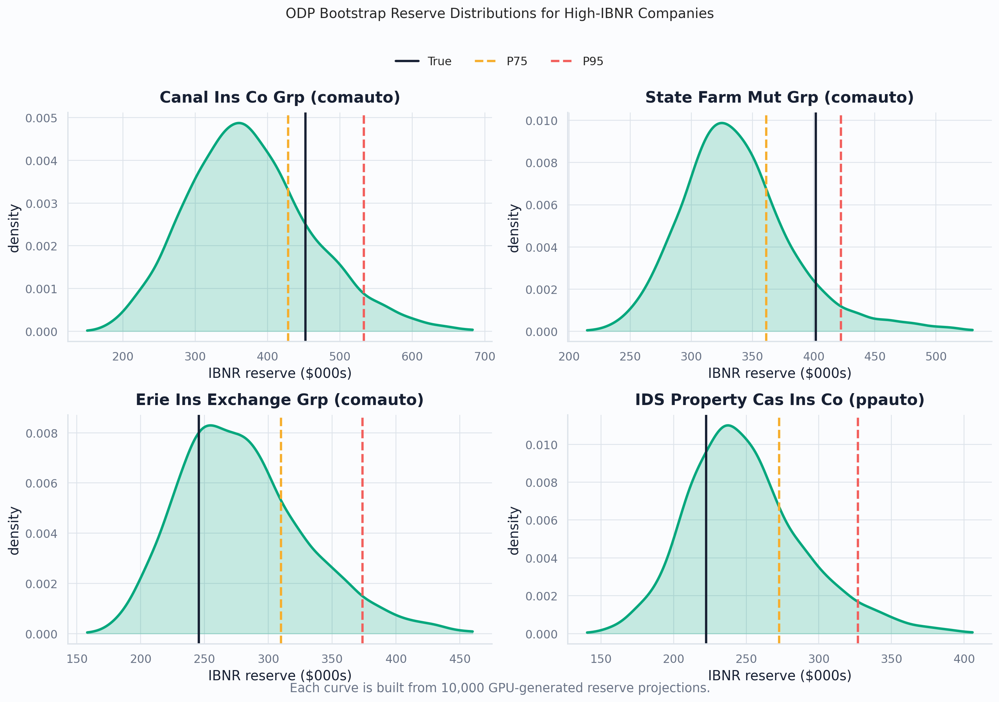
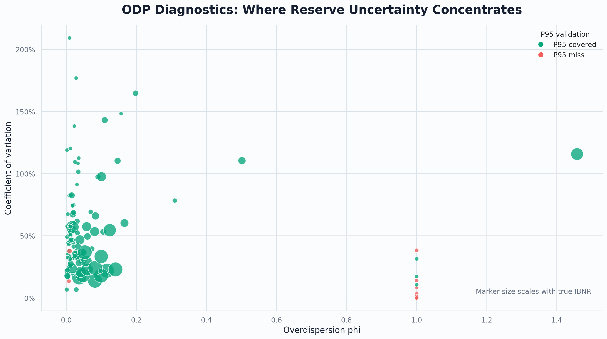

# Blitz

Blitz is a GPU-accelerated actuarial reserving sandbox written with AMD HIP.
It parses Schedule P-style loss triangles, runs thousands of bootstrap
chain-ladder simulations in parallel, and validates estimated IBNR reserve
distributions against observed lower-triangle outcomes.

The project is built as a portfolio piece around practical actuarial modeling,
GPU parallelism, and reproducible reserve validation.

## What It Shows

- Conversion of 10x10 paid-loss triangles into compact binary arrays for HIP.
- A naive factor-resampling chain-ladder bootstrap with one GPU thread per
  bootstrap trial.
- An overdispersed Poisson bootstrap inspired by England-Verrall reserving,
  including residual resampling and phi diagnostics.
- Reserve distribution outputs for best estimate, P75, P95, P99, coefficient
  of variation, and a Cost-of-Capital risk margin illustration.
- Python validation scripts that compare bootstrap estimates against true
  lower-triangle outcomes and posted reserves.

## Repository Layout

| Path | Purpose |
| --- | --- |
| `parse_triangles.py` | Parses `ppauto.csv` and `comauto.csv` into GPU-ready binary triangles. |
| `ibnr_bootstrap.hip` | Naive factor-resampling chain-ladder bootstrap kernel. |
| `ibnr_bootstrap_odp.hip` | Overdispersed Poisson bootstrap kernel with residual resampling. |
| `validate_ibnr.py` | Validates naive bootstrap samples against realized lower-triangle outcomes. |
| `validate_odp.py` | Validates ODP bootstrap samples and reports reserve adequacy metrics. |
| `reserve_charts.py` | Produces Matplotlib/Seaborn charts for the README and portfolio documentation. |
| `rng_test.hip` | Small ROCm random-number sanity check. |
| `ppauto.csv`, `comauto.csv` | Source Schedule P auto-line triangle data used by the parser. |
| `Makefile` | Build and workflow shortcuts for the HIP executables. |

## Requirements

- AMD GPU with ROCm/HIP available on the host.
- `hipcc` and `rocrand` available to the compiler.
- Python 3.10+.
- Python packages from `requirements.txt`.

Install the Python dependency in a local environment:

```bash
python -m venv .venv
source .venv/bin/activate
pip install -r requirements.txt
```

## Build

Build all HIP executables:

```bash
make all
```

If ROCm is installed outside your `PATH`, pass `HIPCC` explicitly:

```bash
make all HIPCC=/opt/rocm/bin/hipcc
```

## Workflow

Generate the GPU input files from the source CSVs:

```bash
python parse_triangles.py
```

This writes:

- `triangles.bin`: `float32` array with shape `(146, 10, 10)`.
- `premiums.bin`: `float32` array with shape `(146, 10)`.
- `companies.txt`: company IDs and labels matching the triangle order.
- `tri_meta.txt`: generated metadata.

Run the naive bootstrap:

```bash
./ibnr_bootstrap
python validate_ibnr.py
```

Run the ODP bootstrap:

```bash
./ibnr_bootstrap_odp
python validate_odp.py
```

The HIP sources currently compile with `N_COMPANIES=146`, matching the included
CSV sample after `parse_triangles.py` filters to complete 10x10 triangles.

## Results

The charts below summarize the GPU workload, reserve calibration, portfolio
reserve stack, and model uncertainty diagnostics.













Regenerate the chart PNGs after running the workflow above:

```bash
python reserve_charts.py --outdir docs/charts
```

To include a measured GPU throughput chart, let the module rerun both HIP
bootstrap executables and parse their timings:

```bash
python reserve_charts.py --benchmark --outdir docs/charts
```

The generated chart set can include a GPU thread-grid heatmap, throughput bars,
calibration lift, portfolio reserve stack, ODP reserve distributions, and
uncertainty diagnostics.

## Generated Artifacts

Generated binary inputs, bootstrap sample files, validation CSVs, compiled
executables, generated chart images, Python caches, and local virtual
environments are intentionally ignored by Git. Regenerate them locally with the
workflow above.

## Notes

This is an educational/portfolio project, not a production reserving system or
financial recommendation engine. The kernels prioritize a clear demonstration
of GPU parallelism and reserve-model validation over production-grade actuarial
governance, data controls, or reporting workflows.
